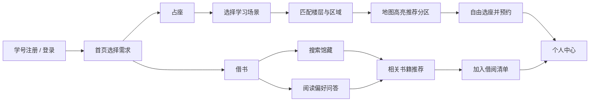
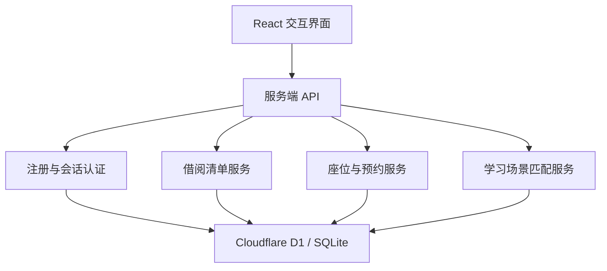

# 知遇图书馆

> 让书与人相遇，也让拥有相同问题的人在图书馆相遇。

知遇图书馆是面向高校图书馆的智能借阅与学习空间服务系统，围绕“借书”和“占座”两项核心需求重新设计图书馆体验。

项目来自 **2026 黑客松 S2 · 赛题 02「图书馆的超进化」**。当前版本以大理理工大学总馆为演示场景，通过本地网页完整呈现用户注册、图书发现、场景化选座、座位预约和个人记录等流程。

## 项目背景

传统图书馆系统通常能回答“书在哪里”和“哪里有空位”，却很少继续理解用户真正想完成的事情：

- 用户知道书名时，可以检索馆藏，但难以自然发现相似作品或相关领域。
- 用户不知道读什么时，需要在庞大的书目中反复筛选。
- 选座系统只呈现空闲状态，没有区分专注自习、讨论解题等不同学习场景。
- 有相同问题和目标的学生可能同时身处图书馆，却缺少低打扰的连接方式。

知遇图书馆尝试把图书馆从“资源存放空间”升级为能够理解阅读意图、组织学习场景并促成知识相遇的校园服务入口。

## 核心功能

### 1. 图书搜索与关联发现

- 支持按照书名、作者或索书号搜索馆藏。
- 展示馆藏位置、索书号、可借数量等关键信息。
- 根据搜索结果推荐内容相似或领域相关的书籍。
- 用简短、具体的推荐理由说明书籍之间的联系。

### 2. 阅读偏好问答

当用户不知道读什么时，可以通过简单选择题描述当下的阅读状态和兴趣，系统据此生成更适合当天的书目建议，降低选择成本。

### 3. 馆舍地图自由选座

- 按楼层浏览图书馆座位地图。
- 座位分为空闲、使用中、暂离和已选择状态。
- 支持放大地图并横向、纵向浏览完整馆舍设施。
- 可选择使用时段并完成座位预约。
- 预约结果会保存到个人账户中。

### 4. 学习场景匹配

选座前，系统会询问用户今天来到图书馆的主要目的：

- 专注自习
- 讨论解题
- 阅读查找
- 其他安排

选择“讨论解题”后，系统会继续询问编程与技术、产品与设计、竞赛项目、课程作业等问题方向。随后结合使用时段和同类需求的聚集情况，推荐更合适的楼层与区域。

推荐结果可以直接联动馆舍地图，并高亮目标分区。同一时段选择相同方向的用户只以聚合人数呈现，不展示姓名、学号等个人身份。

### 5. 用户与个人记录

- 使用学号和密码注册、登录。
- 密码经过独立盐值和 PBKDF2-SHA256 派生后存储。
- 登录会话、借阅清单、座位预约和学习场景选择均持久化保存。
- “我的”页面集中呈现当前预约和借阅记录。

## 产品流程



## 项目创新点

| 创新方向 | 传统方式 | 知遇图书馆 |
| --- | --- | --- |
| 图书发现 | 精确检索单本馆藏 | 在搜索结果之外提供相似内容和相关领域推荐 |
| 阅读决策 | 用户自行浏览分类 | 通过轻量问答理解当下阅读偏好 |
| 座位选择 | 只按照空闲状态选择 | 同时考虑学习目的、讨论方向和空间属性 |
| 学习连接 | 同处一馆但彼此不可见 | 用匿名聚合信号呈现同方向需求，形成自然的学习聚集 |
| 隐私保护 | 直接展示用户信息风险较高 | 只展示趋势和人数，不公开个人身份 |

## 技术架构



主要技术：

- React 19
- TypeScript
- Vinext 与 Vite
- Cloudflare D1 / SQLite
- Drizzle ORM 与 Drizzle Kit
- 原生 CSS 响应式界面
- Web Crypto API 密码派生与会话保护

## 本地运行

### 环境要求

- Node.js `22.13.0` 或更高版本
- npm

### 启动项目

```bash
npm install
npm run dev
```

启动成功后，在浏览器访问：

```text
http://localhost:3000
```

首次进入系统时，请使用 8 至 12 位数字学号注册账号。数据库表和演示座位数据会在本地运行时自动初始化。

### 常用命令

| 命令 | 用途 |
| --- | --- |
| `npm run dev` | 启动本地开发环境 |
| `npm run build` | 构建并检查项目 |
| `npm test` | 执行项目测试 |
| `npm run db:generate` | 根据数据结构生成数据库迁移 |

## 项目结构

```text
libraryos-web/
├─ app/                 页面、样式与服务端 API
│  └─ api/              登录、借阅、座位、预约和场景匹配接口
├─ db/                  数据结构与本地初始化逻辑
├─ drizzle/             数据库迁移文件
├─ lib/server/          服务端认证工具
├─ public/              公共静态资源
├─ tests/               项目测试
├─ package.json         项目依赖与运行脚本
└─ README.md            项目说明
```

## 建议演示流程

1. 使用学号完成注册并登录。
2. 在首页选择“借书”，搜索一本已知书籍并观察关联推荐。
3. 打开阅读偏好问答，体验“不知道读什么”时的推荐路径。
4. 返回首页选择“占座”。
5. 选择“讨论解题”和具体问题方向，生成区域建议。
6. 点击“在地图中定位”，观察楼层切换和推荐分区高亮。
7. 选择一个空闲座位并完成预约。
8. 在“我的”页面查看预约与借阅记录。

## 当前状态

本项目目前为黑客松可交互原型。馆藏、座位和部分实时状态使用演示数据，注册登录、借阅清单、场景选择与座位预约已经接入持久化存储。

后续可继续接入真实馆藏系统、校园统一身份认证、室内定位、到馆签到设备和经过授权的学习协作机制。
